 
 
This notebook presents a data-driven analysis of the COVID-19 pandemic using a combination of global and India-specific datasets. The analysis starts with mostly raw, imperfect public data and examines how COVID-19 outcomes varied across countries and across Indian states, while accounting for reporting differences and structural factors.

The study begins with an exploratory summary of the datasets using descriptive statistics and visualizations, then formulates two testable hypotheses: one comparing India's outcomes with global peers, and another examining variation in reported case fatality rates across Indian states. Each hypothesis is quantified using clearly defined metrics such as cases per million, deaths per million, and case fatality rate (CFR), and is evaluated through targeted visual and statistical comparisons.

The objective is not only to identify patterns, but to show how careful data analysis and contextual reasoning are necessary to draw reliable conclusions from complex real-world data.


```python

# Core imports and visual defaults
import json
import pandas as pd
import matplotlib.pyplot as plt
import seaborn as sns
import plotly.express as px
import geopandas as gpd
from sklearn.manifold import TSNE
from sklearn.preprocessing import StandardScaler

sns.set_theme(style="whitegrid")
plt.rcParams.update({
    "figure.figsize": (10, 6),
    "axes.titlesize": 14,
    "axes.labelsize": 12,
    "xtick.labelsize": 10,
    "ytick.labelsize": 10,
    "legend.fontsize": 10
})

```

## 1) Data Summary with Visual Aids

This section summarizes the datasets used in the study and explains what each one contributes to the overall analysis. In simple terms, the data summary tells us what information is available, how it is structured, and why it is relevant before we test any hypothesis.

It combines health, social, and economic indicators so that later comparisons are based on context rather than raw counts alone. The visual aids provide a quick, interpretable view of trends, variation across regions, and potential relationships between structural factors and COVID-19 outcomes.

### Data Sources and Dataset Overview

This report combines multiple public datasets to study the unequal impact of COVID-19 across countries, Indian states, and socioeconomic groups. Rather than relying on a single source, the analysis integrates epidemiological indicators with structural variables such as healthcare capacity, education, income, employment, digital access, and environmental quality. Together, these datasets help move beyond raw case counts and explain why the pandemic affected regions and populations differently.

#### 1. COVID-19 Core Epidemiological Data
##### India: State-wise Time-Series Data

Source: Government of India (MyGov / MoHFW)

This dataset provides state-level COVID-19 statistics for India, including:

- Confirmed cases
- Active cases
- Recoveries
- Deaths


```python

df = pd.read_csv("india_covid_statewise.csv")

# Remove % sign and convert to float
for col in ["Active Ratio", "Discharge Ratio", "Death Ratio"]:
    df[col] = df[col].str.replace('%','').astype(float)

# India population (approx, used for per-million)
india_population = {
    "Maharashtra": 112374333,
    "Kerala": 33406061,
    "Karnataka": 61095297,
    "Tamil Nadu": 72147030,
    "Andhra Pradesh": 49577103,
    "Uttar Pradesh": 199812341,
    "West Bengal": 91276115,
    "Delhi": 16787941,
    "Odisha": 41974218,
    "Rajasthan": 68548437,
    "Gujarat": 60439692,
    "Chhattisgarh": 25545198,
    "Haryana": 25351462,
    "Madhya Pradesh": 72626809,
    "Bihar": 104099452,
    "Telangana": 35193978,
    "Punjab": 27743338,
    "Assam": 31205576,
    "Jammu and Kashmir": 12541302,
    "Uttarakhand": 10086292,
    "Jharkhand": 32988134,
    "Himachal Pradesh": 6864602,
    "Goa": 1458545,
    "Mizoram": 1097206,
    "Puducherry": 1247953,
    "Manipur": 2855794,
    "Tripura": 3673917,
    "Chandigarh": 1055450,
    "Meghalaya": 2966889,
    "Arunachal Pradesh": 1383727,
    "Sikkim": 610577,
    "Nagaland": 1978502,
    "Ladakh": 274289,
    "Dadra and Nagar Haveli and Daman and Diu": 585764,
    "Lakshadweep": 64473,
    "Andaman and Nicobar Islands": 380581
}


df["Population"] = df["State/UTs"].map(india_population)

df["Cases_per_million"] = (df["Total Cases"] / df["Population"]) * 1e6
df["Deaths_per_million"] = (df["Deaths"] / df["Population"]) * 1e6

state_fix = {
    "Jammu and Kashmir": "Jammu & Kashmir",
    "Andaman and Nicobar Islands": "Andaman & Nicobar",
    "Dadra and Nagar Haveli and Daman and Diu": "Dadra and Nagar Haveli and Daman and Diu"
}
df["CFR (%)"] = (df["Deaths"] / df["Total Cases"]) * 100
df["State_geo"] = df["State/UTs"].replace(state_fix)
df.head()

```


<div>
<style scoped>
    .dataframe tbody tr th:only-of-type {
        vertical-align: middle;
    }

    .dataframe tbody tr th {
        vertical-align: top;
    }

    .dataframe thead th {
        text-align: right;
    }
</style>
<table border="1" class="dataframe">
  <thead>
    <tr style="text-align: right;">
      <th></th>
      <th>State/UTs</th>
      <th>Total Cases</th>
      <th>Active</th>
      <th>Discharged</th>
      <th>Deaths</th>
      <th>Active Ratio</th>
      <th>Discharge Ratio</th>
      <th>Death Ratio</th>
      <th>Population</th>
      <th>Cases_per_million</th>
      <th>Deaths_per_million</th>
      <th>CFR (%)</th>
      <th>State_geo</th>
    </tr>
  </thead>
  <tbody>
    <tr>
      <th>0</th>
      <td>Maharashtra</td>
      <td>8176044</td>
      <td>213</td>
      <td>8027241</td>
      <td>148590</td>
      <td>0.0</td>
      <td>98.18</td>
      <td>1.82</td>
      <td>112374333</td>
      <td>72757.219391</td>
      <td>1322.277036</td>
      <td>1.817383</td>
      <td>Maharashtra</td>
    </tr>
    <tr>
      <th>1</th>
      <td>Kerala</td>
      <td>6917577</td>
      <td>13</td>
      <td>6845461</td>
      <td>72103</td>
      <td>0.0</td>
      <td>98.96</td>
      <td>1.04</td>
      <td>33406061</td>
      <td>207075.506448</td>
      <td>2158.380780</td>
      <td>1.042316</td>
      <td>Kerala</td>
    </tr>
    <tr>
      <th>2</th>
      <td>Karnataka</td>
      <td>4095971</td>
      <td>80</td>
      <td>4055493</td>
      <td>40398</td>
      <td>0.0</td>
      <td>99.01</td>
      <td>0.99</td>
      <td>61095297</td>
      <td>67042.328970</td>
      <td>661.229292</td>
      <td>0.986286</td>
      <td>Karnataka</td>
    </tr>
    <tr>
      <th>3</th>
      <td>Tamil Nadu</td>
      <td>3611584</td>
      <td>10</td>
      <td>3573488</td>
      <td>38086</td>
      <td>0.0</td>
      <td>98.95</td>
      <td>1.05</td>
      <td>72147030</td>
      <td>50058.664924</td>
      <td>527.894218</td>
      <td>1.054551</td>
      <td>Tamil Nadu</td>
    </tr>
    <tr>
      <th>4</th>
      <td>Andhra Pradesh</td>
      <td>2341083</td>
      <td>5</td>
      <td>2326345</td>
      <td>14733</td>
      <td>0.0</td>
      <td>99.37</td>
      <td>0.63</td>
      <td>49577103</td>
      <td>47221.052832</td>
      <td>297.173475</td>
      <td>0.629324</td>
      <td>Andhra Pradesh</td>
    </tr>
  </tbody>
</table>
</div>


```python
plt.figure(figsize=(8,6))
plt.scatter(df["Cases_per_million"], df["Deaths_per_million"])

for i, state in enumerate(df["State/UTs"]):
    plt.annotate(state, 
                 (df["Cases_per_million"][i], df["Deaths_per_million"][i]),
                 fontsize=8, alpha=0.7)

plt.title("COVID-19 Severity: Cases vs Deaths per Million")
plt.xlabel("Cases per Million")
plt.ylabel("Deaths per Million")
plt.grid(True)
plt.show()

```


    
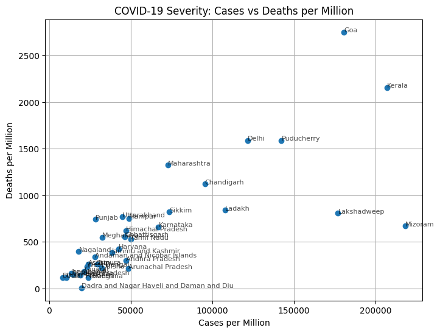
    


```python
top_cfr = df.sort_values("CFR (%)", ascending=False).head(10)

plt.figure(figsize=(10,6))
plt.barh(top_cfr["State/UTs"], top_cfr["CFR (%)"])
plt.xlabel("Case Fatality Rate (%)")
plt.title("Top 10 States by COVID-19 Case Fatality Rate")
plt.gca().invert_yaxis()
plt.grid(axis="x")
plt.show()
```


    
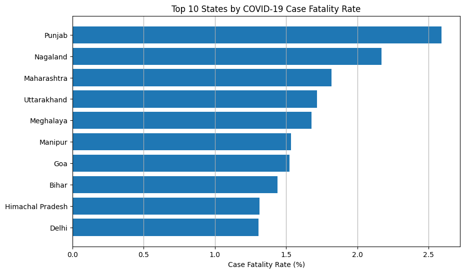
    


##### Global: Country-wise COVID-19 Data

Source: Our World in Data

This dataset provides standardized cross-country indicators such as:

- Cases per million
- Deaths per million
- Testing rates
- Vaccination coverage
- Government stringency index

It supports international comparison and helps place India's trajectory in global context.


```python
# Load dataset
df = pd.read_csv("owid-covid-data.csv")

# Keep country rows only (exclude aggregates like World/Asia)
df = df[df["iso_code"].str.len() == 3].copy()

# Convert date and build latest snapshot per country
df["date"] = pd.to_datetime(df["date"])
latest = df.sort_values("date").groupby("location").tail(1)

# Per-million metrics
latest["cases_per_million"] = (latest["total_cases"] / latest["population"]) * 1_000_000
latest["deaths_per_million"] = (latest["total_deaths"] / latest["population"]) * 1_000_000

latest[["location", "cases_per_million", "deaths_per_million"]].head()
```


<div>
<style scoped>
    .dataframe tbody tr th:only-of-type {
        vertical-align: middle;
    }

    .dataframe tbody tr th {
        vertical-align: top;
    }

    .dataframe thead th {
        text-align: right;
    }
</style>
<table border="1" class="dataframe">
  <thead>
    <tr style="text-align: right;">
      <th></th>
      <th>iso_code</th>
      <th>continent</th>
      <th>location</th>
      <th>date</th>
      <th>total_cases</th>
      <th>new_cases</th>
      <th>new_cases_smoothed</th>
      <th>total_deaths</th>
      <th>new_deaths</th>
      <th>new_deaths_smoothed</th>
      <th>...</th>
      <th>male_smokers</th>
      <th>handwashing_facilities</th>
      <th>hospital_beds_per_thousand</th>
      <th>life_expectancy</th>
      <th>human_development_index</th>
      <th>population</th>
      <th>excess_mortality_cumulative_absolute</th>
      <th>excess_mortality_cumulative</th>
      <th>excess_mortality</th>
      <th>excess_mortality_cumulative_per_million</th>
    </tr>
  </thead>
  <tbody>
    <tr>
      <th>429430</th>
      <td>ZWE</td>
      <td>Africa</td>
      <td>Zimbabwe</td>
      <td>2024-07-31</td>
      <td>266386.0</td>
      <td>0.0</td>
      <td>0.0</td>
      <td>5740.0</td>
      <td>0.0</td>
      <td>0.0</td>
      <td>...</td>
      <td>30.7</td>
      <td>36.79</td>
      <td>1.7</td>
      <td>61.49</td>
      <td>0.57</td>
      <td>16320539</td>
      <td>NaN</td>
      <td>NaN</td>
      <td>NaN</td>
      <td>NaN</td>
    </tr>
    <tr>
      <th>429431</th>
      <td>ZWE</td>
      <td>Africa</td>
      <td>Zimbabwe</td>
      <td>2024-08-01</td>
      <td>266386.0</td>
      <td>0.0</td>
      <td>0.0</td>
      <td>5740.0</td>
      <td>0.0</td>
      <td>0.0</td>
      <td>...</td>
      <td>30.7</td>
      <td>36.79</td>
      <td>1.7</td>
      <td>61.49</td>
      <td>0.57</td>
      <td>16320539</td>
      <td>NaN</td>
      <td>NaN</td>
      <td>NaN</td>
      <td>NaN</td>
    </tr>
    <tr>
      <th>429432</th>
      <td>ZWE</td>
      <td>Africa</td>
      <td>Zimbabwe</td>
      <td>2024-08-02</td>
      <td>266386.0</td>
      <td>0.0</td>
      <td>0.0</td>
      <td>5740.0</td>
      <td>0.0</td>
      <td>0.0</td>
      <td>...</td>
      <td>30.7</td>
      <td>36.79</td>
      <td>1.7</td>
      <td>61.49</td>
      <td>0.57</td>
      <td>16320539</td>
      <td>NaN</td>
      <td>NaN</td>
      <td>NaN</td>
      <td>NaN</td>
    </tr>
    <tr>
      <th>429433</th>
      <td>ZWE</td>
      <td>Africa</td>
      <td>Zimbabwe</td>
      <td>2024-08-03</td>
      <td>266386.0</td>
      <td>0.0</td>
      <td>0.0</td>
      <td>5740.0</td>
      <td>0.0</td>
      <td>0.0</td>
      <td>...</td>
      <td>30.7</td>
      <td>36.79</td>
      <td>1.7</td>
      <td>61.49</td>
      <td>0.57</td>
      <td>16320539</td>
      <td>NaN</td>
      <td>NaN</td>
      <td>NaN</td>
      <td>NaN</td>
    </tr>
    <tr>
      <th>429434</th>
      <td>ZWE</td>
      <td>Africa</td>
      <td>Zimbabwe</td>
      <td>2024-08-04</td>
      <td>266386.0</td>
      <td>0.0</td>
      <td>0.0</td>
      <td>5740.0</td>
      <td>0.0</td>
      <td>0.0</td>
      <td>...</td>
      <td>30.7</td>
      <td>36.79</td>
      <td>1.7</td>
      <td>61.49</td>
      <td>0.57</td>
      <td>16320539</td>
      <td>NaN</td>
      <td>NaN</td>
      <td>NaN</td>
      <td>NaN</td>
    </tr>
  </tbody>
</table>
<p>5 rows × 67 columns</p>
</div>


```python
top10 = latest.sort_values("total_cases", ascending=False).head(10)
top10 = pd.concat([top10, latest[latest["location"] == "India"]]).drop_duplicates("location")

plt.figure(figsize=(10,6))

sns.scatterplot(
    data=top10,
    x="cases_per_million",
    y="deaths_per_million",
    hue="location",
    s=200
)

plt.xlabel("Cases per Million")
plt.ylabel("Deaths per Million")
plt.title("Top 10 Countries: COVID-19 Impact Comparison")
plt.legend(bbox_to_anchor=(1.05, 1))
plt.show()

```


    
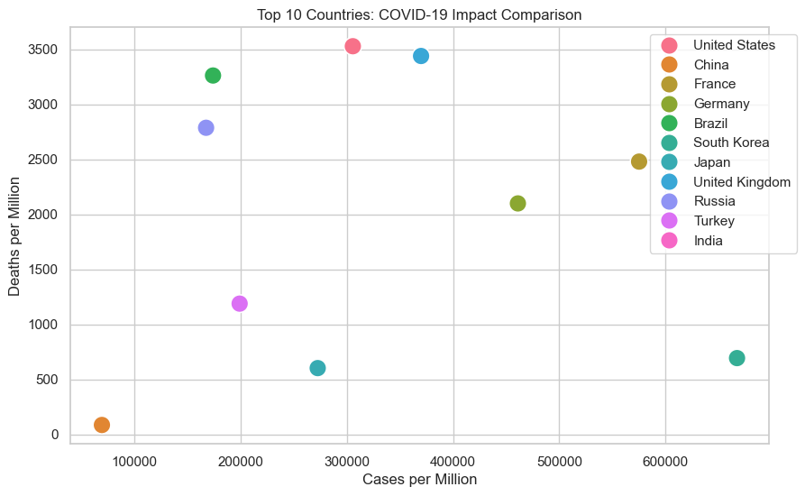
    


```python
india_ts = df[df["location"] == "India"].set_index("date")
global_ts = (
    df.groupby("date")["new_cases"]
    .sum()
    .rolling(7, min_periods=1)
    .mean()
    .rename("global_new_cases")
)

plt.figure(figsize=(12, 6))
plt.plot(global_ts, label="World (7-day mean)", alpha=0.7)
plt.plot(
    india_ts["new_cases"].rolling(7, min_periods=1).mean(),
    label="India (7-day mean)",
    linewidth=2
)

plt.xlabel("Date")
plt.ylabel("Daily New Cases")
plt.title("India vs Global COVID-19 Waves")
plt.legend()
plt.yscale("log")
plt.tight_layout()
plt.show()
```


    
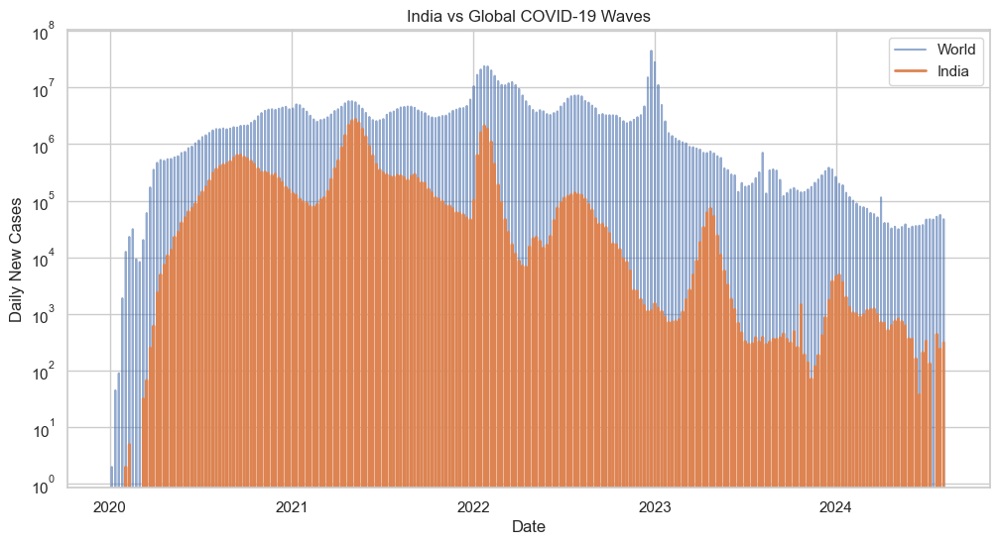
    


```python
# Select only countries and keep rows with required fields
tsne_df = latest.dropna(subset=[
    "population", "cases_per_million", "deaths_per_million", "continent", "location"
]).copy()

features = tsne_df[["cases_per_million", "deaths_per_million"]]
X = StandardScaler().fit_transform(features)

tsne = TSNE(n_components=2, perplexity=25, random_state=42)
X_tsne = tsne.fit_transform(X)

plt.figure(figsize=(10, 7))

continents = tsne_df["continent"].unique()

for cont in continents:
    idx = tsne_df["continent"] == cont
    plt.scatter(
        X_tsne[idx, 0],
        X_tsne[idx, 1],
        s=60,
        alpha=0.6,
        label=cont
    )

plt.title(
    "Countries Grouped by COVID-19 Impact\n(Cases & Deaths per Million)",
    fontsize=14
)
plt.xlabel("t-SNE Component 1")
plt.ylabel("t-SNE Component 2")

plt.legend(
    title="Region",
    bbox_to_anchor=(1.05, 1),
    loc="upper left"
 )

plt.tight_layout()
plt.show()
```


    
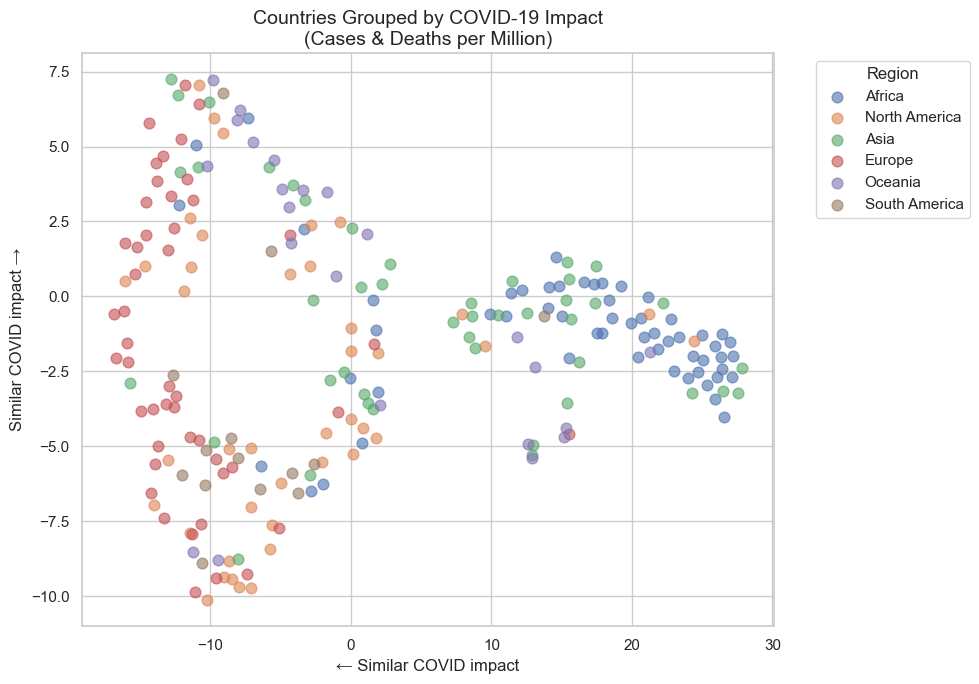
    


#### 2. Healthcare Infrastructure Availability
##### India: Health Infrastructure

Sources: National Health Profile (NHP), NFHS

Healthcare capacity is a key determinant of COVID-19 outcomes. This dataset provides state-level indicators including:

- Hospital counts
- Beds per 1,000 population
- Spatial distribution of healthcare facilities


```python
import pandas as pd
import matplotlib.pyplot as plt

# Load dataset
df = pd.read_csv(
    "hospital_directory.csv",
    low_memory=False
)

# ------------------ Clean numeric columns ------------------
df["Total_Num_Beds"] = pd.to_numeric(df["Total_Num_Beds"], errors="coerce")
df["Number_Doctor"] = pd.to_numeric(df["Number_Doctor"], errors="coerce")

df["State"] = df["State"].str.strip()

# ------------------ Population data ------------------
india_population = {
    "Maharashtra": 112374333,
    "Kerala": 33406061,
    "Karnataka": 61095297,
    "Tamil Nadu": 72147030,
    "Andhra Pradesh": 49577103,
    "Uttar Pradesh": 199812341,
    "West Bengal": 91276115,
    "Delhi": 16787941,
    "Odisha": 41974218,
    "Rajasthan": 68548437,
    "Gujarat": 60439692,
    "Chhattisgarh": 25545198,
    "Haryana": 25351462,
    "Madhya Pradesh": 72626809,
    "Bihar": 104099452,
    "Telangana": 35193978,
    "Punjab": 27743338,
    "Assam": 31205576,
    "Jammu and Kashmir": 12541302,
    "Uttarakhand": 10086292,
    "Jharkhand": 32988134,
    "Himachal Pradesh": 6864602,
    "Goa": 1458545
}

# ------------------ State-level aggregation ------------------
state_df = (
    df.groupby("State")
      .agg(
          Hospital_Count=("Hospital_Name", "count"),
          Total_Beds=("Total_Num_Beds", "sum")
      )
      .reset_index()
)

state_df["Population"] = state_df["State"].map(india_population)
state_df = state_df.dropna()

state_df["Hospitals_per_1000"] = (
    state_df["Hospital_Count"] / state_df["Population"]
) * 1000

state_df["Beds_per_1000"] = (
    state_df["Total_Beds"] / state_df["Population"]
) * 1000
state_df.head()
```


<div>
<style scoped>
    .dataframe tbody tr th:only-of-type {
        vertical-align: middle;
    }

    .dataframe tbody tr th {
        vertical-align: top;
    }

    .dataframe thead th {
        text-align: right;
    }
</style>
<table border="1" class="dataframe">
  <thead>
    <tr style="text-align: right;">
      <th></th>
      <th>State</th>
      <th>Hospital_Count</th>
      <th>Total_Beds</th>
      <th>Population</th>
      <th>Hospitals_per_1000</th>
      <th>Beds_per_1000</th>
    </tr>
  </thead>
  <tbody>
    <tr>
      <th>1</th>
      <td>Andhra Pradesh</td>
      <td>1380</td>
      <td>0.0</td>
      <td>49577103.0</td>
      <td>0.027835</td>
      <td>0.0</td>
    </tr>
    <tr>
      <th>3</th>
      <td>Assam</td>
      <td>183</td>
      <td>0.0</td>
      <td>31205576.0</td>
      <td>0.005864</td>
      <td>0.0</td>
    </tr>
    <tr>
      <th>4</th>
      <td>Bihar</td>
      <td>1039</td>
      <td>0.0</td>
      <td>104099452.0</td>
      <td>0.009981</td>
      <td>0.0</td>
    </tr>
    <tr>
      <th>6</th>
      <td>Chhattisgarh</td>
      <td>445</td>
      <td>0.0</td>
      <td>25545198.0</td>
      <td>0.017420</td>
      <td>0.0</td>
    </tr>
    <tr>
      <th>9</th>
      <td>Goa</td>
      <td>84</td>
      <td>0.0</td>
      <td>1458545.0</td>
      <td>0.057592</td>
      <td>0.0</td>
    </tr>
  </tbody>
</table>
</div>


```python
plt.figure()
plt.bar(state_df["State"], state_df["Hospital_Count"])
plt.xticks(rotation=90)
plt.title("Number of Hospitals by State")
plt.ylabel("Hospital Count")
plt.xlabel("State")
plt.show()

```


    
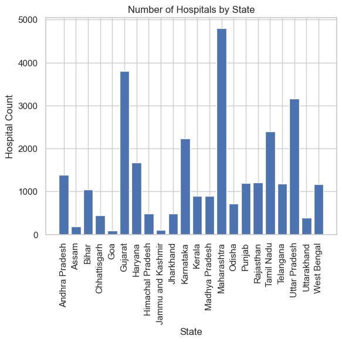
    


```python
plt.figure()
plt.bar(state_df["State"], state_df["Hospitals_per_1000"])
plt.xticks(rotation=90)
plt.title("Hospitals per 1,000 Population")
plt.ylabel("Hospitals per 1,000")
plt.xlabel("State")
plt.show()

```


    
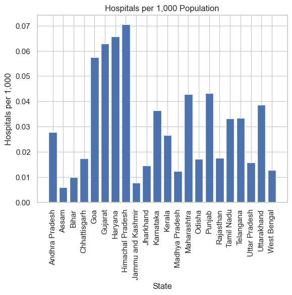
    


#### 3. Education, Income, and Structural Advantage
##### India: State-wise Socioeconomic Indicators

Sources: Census of India, Reserve Bank of India, NITI Aayog

This dataset captures long-term structural characteristics of Indian states, including:

- Literacy rate
- Per-capita NSDP
- Urbanization share

These indicators are treated as pre-existing conditions that may shape a state's resilience during the pandemic.


```python
top_lit = df.sort_values("Literacy_rate", ascending=False).head(10)

plt.barh(top_lit["State_UT"], top_lit["CFR"])
plt.xlabel("CFR (%)")
plt.title("CFR in Top 10 Literate States")
plt.gca().invert_yaxis()
plt.show()

```


    
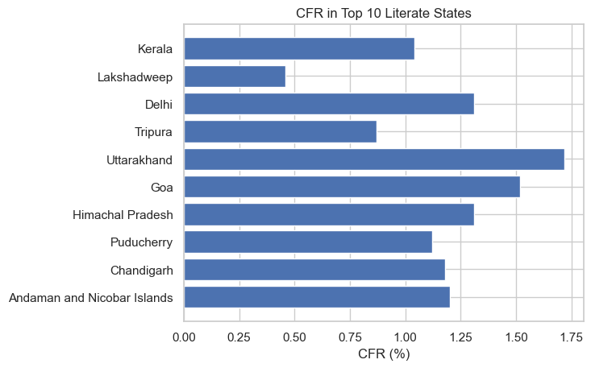
    


```python
import pandas as pd
import matplotlib.pyplot as plt

df = pd.read_csv("Literacy_rate.csv")

median_income = df["NSDP_pc"].median()
df["Dev_Group"] = df["NSDP_pc"].apply(
    lambda x: "High income states" if x >= median_income else "Low income states"
)

data = [
    df[df["Dev_Group"] == "High income states"]["CFR"],
    df[df["Dev_Group"] == "Low income states"]["CFR"]
]

plt.boxplot(data, labels=["High income", "Low income"])
plt.ylabel("COVID CFR (%)")
plt.title("Distribution of CFR across Development Groups")
plt.show()

```

    C:\Users\YASH GOYAL\AppData\Local\Temp\ipykernel_33220\490785262.py:16: MatplotlibDeprecationWarning:
    
    The 'labels' parameter of boxplot() has been renamed 'tick_labels' since Matplotlib 3.9; support for the old name will be dropped in 3.11.
    
    


    
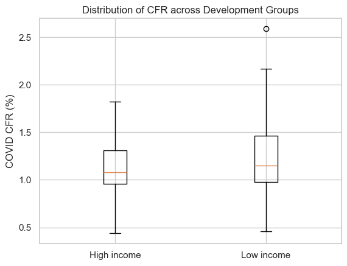
    


```python
import numpy as np

corr = df[["Literacy_rate", "NSDP_pc", "Cases_per_million", "CFR"]].corr()

plt.imshow(corr, cmap="coolwarm")
plt.colorbar()
plt.xticks(range(len(corr)), corr.columns, rotation=45)
plt.yticks(range(len(corr)), corr.columns)
plt.title("Correlation Structure of Socioeconomic Variables and CFR")
plt.show()

```


    
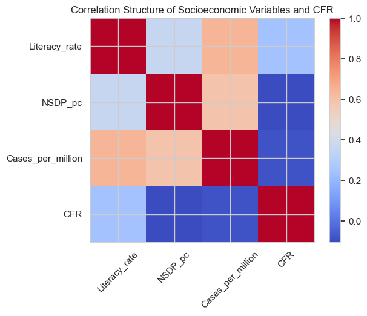
    


```python
df_sorted = df.sort_values("Cases_per_million", ascending=False).head(10)

plt.bar(df_sorted["State_UT"], df_sorted["Cases_per_million"], label="Cases per million")
plt.xticks(rotation=45)
plt.ylabel("Cases per million")
plt.title("Highest COVID Exposure States")
plt.show()

```


    
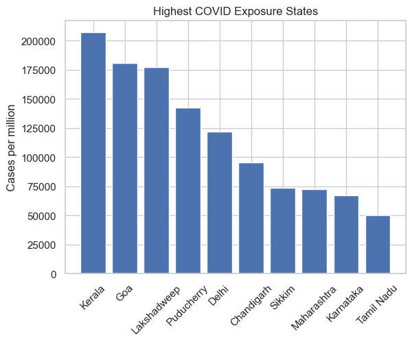
    


#### 4. Inequality and Daily-Wage Employment Impact
##### India: Employment Shock

Source: CMIE Consumer Pyramids

This dataset captures the economic shock of COVID-19, especially for informal and daily-wage workers, including:

- Unemployment rates
- Employment disruption over time

It highlights how livelihood impacts were often uneven and, in many regions, more severe than headline health indicators suggest.


```python

df = pd.read_csv("india_unemployment_ilo_1991_2024.csv")

print(df.head())

```

       Year  Unemployment_Rate_Percent
    0  1991                      7.641
    1  1992                      7.649
    2  1993                      7.662
    3  1994                      7.193
    4  1995                      7.170
    


```python
import pandas as pd
import matplotlib.pyplot as plt

# Load CSV
df = pd.read_csv("india_unemployment_ilo_1991_2024.csv")

# Focus on recent years
plot_df = df[df["Year"] >= 2015]

# Split periods
pre_covid = plot_df[plot_df["Year"] <= 2019]
covid = plot_df[(plot_df["Year"] >= 2020) & (plot_df["Year"] <= 2021)]
recovery = plot_df[plot_df["Year"] >= 2022]

plt.figure(figsize=(10,5))

# Plot bars for each period
plt.bar(pre_covid["Year"], pre_covid["Unemployment_Rate_Percent"], label="Pre-COVID")
plt.bar(covid["Year"], covid["Unemployment_Rate_Percent"], label="COVID Period")
plt.bar(recovery["Year"], recovery["Unemployment_Rate_Percent"], label="Post-COVID Recovery")

plt.title("India Unemployment Rate: Pre-COVID, COVID Shock and Recovery")
plt.xlabel("Year")
plt.ylabel("Unemployment Rate (%)")
plt.legend()
plt.show()

```


    
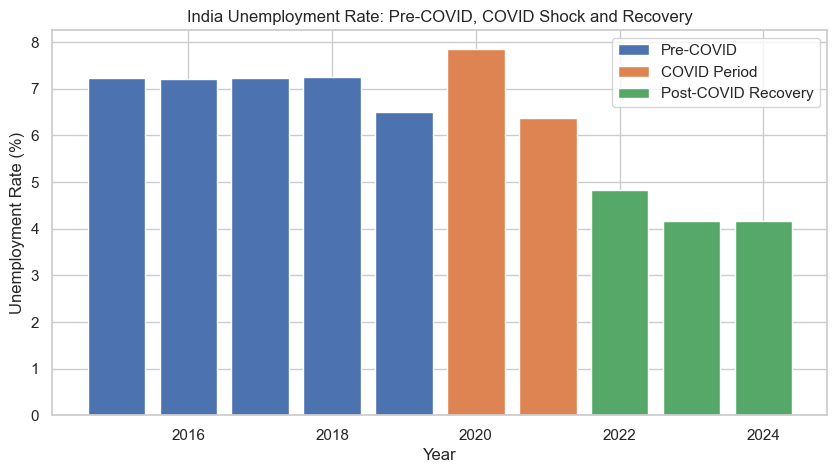
    


```python
plt.figure(figsize=(10, 5))
plt.plot(df["Year"], df["Unemployment_Rate_Percent"])

# Highlight COVID years
plt.axvspan(2019.5, 2020.5, alpha=0.2)

plt.title("Unemployment Trend with COVID-19 Period Highlighted")
plt.xlabel("Year")
plt.ylabel("Unemployment Rate (%)")
plt.show()

```


    
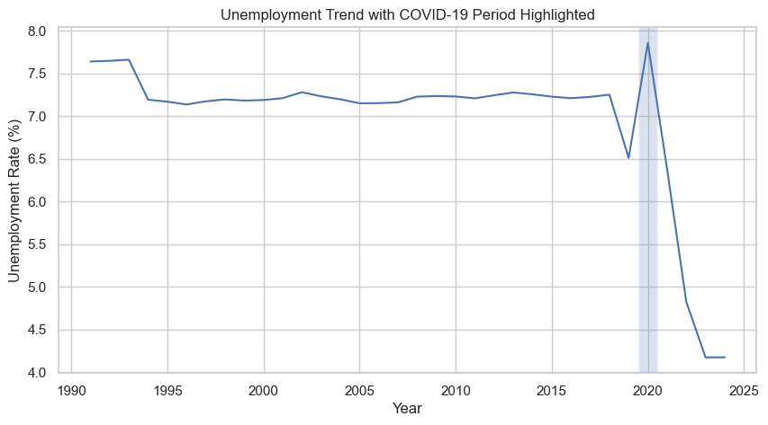
    


Further work could extend this analysis to education disparity and environmental outcomes, but the current scope is sufficient to define, quantify, and test the two hypotheses below.


### Hypothesis 1: India vs Global Comparison

India's reported COVID-19 deaths per million were lower than many comparable countries, even though India had high case burden and lower average structural capacity (for example, GDP per capita and hospital beds per thousand).

#### What this hypothesis tests
The goal is to test whether India's reported mortality burden is relatively low in per-capita terms when compared with countries that are either large in population or high in case burden.

#### Why this is relevant
- India has one of the world's largest populations.
- India reported large absolute case counts.
- Structural capacity indicators are lower than in many high-income countries.

If deaths per million are still comparatively low, the pattern is analytically important and worth quantifying explicitly.

#### Datasets used
- owid-covid-data.csv (global country-level indicators)
- india_covid_statewise.csv (state aggregation for India-specific construction checks)

#### Quantification strategy
##### 1. Primary outcome metrics
- Cases per million
- Deaths per million

##### 2. Comparison groups
- India
- Top countries by case burden
- Top countries by population

#### Planned analysis

##### 1. Compute
- Cases per million
- Deaths per million

##### 2. Visual comparisons
- Scatter plot: cases per million vs deaths per million
- Highlight India against comparable countries
- Bar chart: deaths per million for selected peers

##### 3. Statistical framing
- India's percentile rank in deaths per million
- India's numeric rank among countries in each peer group

### Step 1: Prepare a COUNTRY-LEVEL COVID DATASET (Global)


```python
import pandas as pd

# Load OWID dataset
owid = pd.read_csv("owid-covid-data.csv")

# Keep only country rows (remove aggregates like World, Asia, etc.)
owid = owid[owid["iso_code"].str.len() == 3]

# Convert date
owid["date"] = pd.to_datetime(owid["date"])

# Get latest available data per country
latest = owid.sort_values("date").groupby("location").tail(1)

# Select required columns
global_df = latest[[
    "location",
    "population",
    "total_cases_per_million",
    "total_deaths_per_million",
    "hospital_beds_per_thousand",
    "gdp_per_capita"
]].dropna(subset=["population", "total_cases_per_million", "total_deaths_per_million"])

global_df.head()

```


<div>
<style scoped>
    .dataframe tbody tr th:only-of-type {
        vertical-align: middle;
    }

    .dataframe tbody tr th {
        vertical-align: top;
    }

    .dataframe thead th {
        text-align: right;
    }
</style>
<table border="1" class="dataframe">
  <thead>
    <tr style="text-align: right;">
      <th></th>
      <th>location</th>
      <th>population</th>
      <th>total_cases_per_million</th>
      <th>total_deaths_per_million</th>
      <th>hospital_beds_per_thousand</th>
      <th>gdp_per_capita</th>
    </tr>
  </thead>
  <tbody>
    <tr>
      <th>331148</th>
      <td>Saint Vincent and the Grenadines</td>
      <td>103959</td>
      <td>94785.52</td>
      <td>1214.95</td>
      <td>2.6</td>
      <td>10727.15</td>
    </tr>
    <tr>
      <th>68647</th>
      <td>Cayman Islands</td>
      <td>68722</td>
      <td>439497.84</td>
      <td>516.70</td>
      <td>NaN</td>
      <td>49903.03</td>
    </tr>
    <tr>
      <th>113538</th>
      <td>Eritrea</td>
      <td>3684041</td>
      <td>2988.46</td>
      <td>30.21</td>
      <td>0.7</td>
      <td>1510.46</td>
    </tr>
    <tr>
      <th>58603</th>
      <td>Burkina Faso</td>
      <td>22673764</td>
      <td>983.56</td>
      <td>17.77</td>
      <td>0.4</td>
      <td>1703.10</td>
    </tr>
    <tr>
      <th>118568</th>
      <td>Ethiopia</td>
      <td>123379928</td>
      <td>3997.26</td>
      <td>60.41</td>
      <td>0.3</td>
      <td>1729.93</td>
    </tr>
  </tbody>
</table>
</div>


### Step 2: Create INDIA-AS-A-COUNTRY ROW


```python
india_states = pd.read_csv("india_covid_statewise.csv")

india_states["Total Cases"] = pd.to_numeric(india_states["Total Cases"])
india_states["Deaths"] = pd.to_numeric(india_states["Deaths"])

india_total_cases = india_states["Total Cases"].sum()
india_total_deaths = india_states["Deaths"].sum()

india_population = {
    "Maharashtra": 112374333,
    "Kerala": 33406061,
    "Karnataka": 61095297,
    "Tamil Nadu": 72147030,
    "Andhra Pradesh": 49577103,
    "Uttar Pradesh": 199812341,
    "West Bengal": 91276115,
    "Delhi": 16787941,
    "Odisha": 41974218,
    "Rajasthan": 68548437,
    "Gujarat": 60439692,
    "Chhattisgarh": 25545198,
    "Haryana": 25351462,
    "Madhya Pradesh": 72626809,
    "Bihar": 104099452,
    "Telangana": 35193978,
    "Punjab": 27743338,
    "Assam": 31205576,
    "Jammu and Kashmir": 12541302,
    "Uttarakhand": 10086292,
    "Jharkhand": 32988134,
    "Himachal Pradesh": 6864602,
    "Goa": 1458545,
    "Mizoram": 1097206,
    "Puducherry": 1247953,
    "Manipur": 2855794,
    "Tripura": 3673917,
    "Chandigarh": 1055450,
    "Meghalaya": 2966889,
    "Arunachal Pradesh": 1383727,
    "Sikkim": 610577,
    "Nagaland": 1978502,
    "Ladakh": 274289,
    "Dadra and Nagar Haveli and Daman and Diu": 585764,
    "Lakshadweep": 64473,
    "Andaman and Nicobar Islands": 380581
}

india_population_total = sum(india_population.values())
india_cases_per_million = (india_total_cases / india_population_total) * 1e6
india_deaths_per_million = (india_total_deaths / india_population_total) * 1e6

owid = pd.read_csv("owid-covid-data.csv")
india_owid = owid[owid["location"] == "India"].copy()

india_population_owid = india_owid["population"].dropna().iloc[-1]
india_gdp_per_capita = india_owid["gdp_per_capita"].dropna().iloc[-1]
india_hospital_beds = india_owid["hospital_beds_per_thousand"].dropna().iloc[-1]

india_country_row = pd.DataFrame([{
    "location": "India",
    "population": india_population_owid,
    "total_cases_per_million": india_cases_per_million,
    "total_deaths_per_million": india_deaths_per_million,
    "gdp_per_capita": india_gdp_per_capita,
    "hospital_beds_per_thousand": india_hospital_beds
}])

india_country_row
```


<div>
<style scoped>
    .dataframe tbody tr th:only-of-type {
        vertical-align: middle;
    }

    .dataframe tbody tr th {
        vertical-align: top;
    }

    .dataframe thead th {
        text-align: right;
    }
</style>
<table border="1" class="dataframe">
  <thead>
    <tr style="text-align: right;">
      <th></th>
      <th>location</th>
      <th>population</th>
      <th>total_cases_per_million</th>
      <th>total_deaths_per_million</th>
      <th>gdp_per_capita</th>
      <th>hospital_beds_per_thousand</th>
    </tr>
  </thead>
  <tbody>
    <tr>
      <th>0</th>
      <td>India</td>
      <td>1417173120</td>
      <td>37173.965836</td>
      <td>440.41683</td>
      <td>6426.67</td>
      <td>0.53</td>
    </tr>
  </tbody>
</table>
</div>


```python
# Remove OWID's India row
global_df_no_india = global_df[global_df["location"] != "India"]

# Add manually computed India
global_df = pd.concat(
    [global_df_no_india, india_country_row],
    ignore_index=True
)

# Verify
global_df[global_df["location"] == "India"]

```


<div>
<style scoped>
    .dataframe tbody tr th:only-of-type {
        vertical-align: middle;
    }

    .dataframe tbody tr th {
        vertical-align: top;
    }

    .dataframe thead th {
        text-align: right;
    }
</style>
<table border="1" class="dataframe">
  <thead>
    <tr style="text-align: right;">
      <th></th>
      <th>location</th>
      <th>population</th>
      <th>total_cases_per_million</th>
      <th>total_deaths_per_million</th>
      <th>hospital_beds_per_thousand</th>
      <th>gdp_per_capita</th>
    </tr>
  </thead>
  <tbody>
    <tr>
      <th>226</th>
      <td>India</td>
      <td>1417173120</td>
      <td>37173.965836</td>
      <td>440.41683</td>
      <td>0.53</td>
      <td>6426.67</td>
    </tr>
  </tbody>
</table>
</div>


### Step 3: Define Comparison Groups

India is compared against two peer groups:
- Group A: Top 10 countries by total cases per million
- Group B: Top 10 countries by population


```python
# Top 10 by cases per million
top_cases = global_df.sort_values(
    "total_cases_per_million", ascending=False
).head(10)

# Top 10 by population
top_population = global_df.sort_values(
    "population", ascending=False
).head(10)

# India row
india_global = global_df[global_df["location"] == "India"]

# Combine both groups + India
comparison_df = pd.concat([
    top_cases,
    top_population,
    india_global
]).drop_duplicates(subset="location")

comparison_df
```


<div>
<style scoped>
    .dataframe tbody tr th:only-of-type {
        vertical-align: middle;
    }

    .dataframe tbody tr th {
        vertical-align: top;
    }

    .dataframe thead th {
        text-align: right;
    }
</style>
<table border="1" class="dataframe">
  <thead>
    <tr style="text-align: right;">
      <th></th>
      <th>location</th>
      <th>population</th>
      <th>total_cases_per_million</th>
      <th>total_deaths_per_million</th>
      <th>hospital_beds_per_thousand</th>
      <th>gdp_per_capita</th>
    </tr>
  </thead>
  <tbody>
    <tr>
      <th>28</th>
      <td>Brunei</td>
      <td>449002</td>
      <td>763598.600000</td>
      <td>393.08000</td>
      <td>2.70</td>
      <td>71809.25</td>
    </tr>
    <tr>
      <th>38</th>
      <td>San Marino</td>
      <td>33690</td>
      <td>741418.250000</td>
      <td>3693.61000</td>
      <td>3.80</td>
      <td>56861.47</td>
    </tr>
    <tr>
      <th>193</th>
      <td>Austria</td>
      <td>8939617</td>
      <td>671004.900000</td>
      <td>2485.91000</td>
      <td>7.37</td>
      <td>45436.69</td>
    </tr>
    <tr>
      <th>26</th>
      <td>South Korea</td>
      <td>51815808</td>
      <td>667636.060000</td>
      <td>693.94000</td>
      <td>12.27</td>
      <td>35938.37</td>
    </tr>
    <tr>
      <th>114</th>
      <td>Martinique</td>
      <td>367512</td>
      <td>659169.440000</td>
      <td>3159.15000</td>
      <td>NaN</td>
      <td>NaN</td>
    </tr>
    <tr>
      <th>141</th>
      <td>Jersey</td>
      <td>110796</td>
      <td>641502.300000</td>
      <td>1555.66000</td>
      <td>NaN</td>
      <td>NaN</td>
    </tr>
    <tr>
      <th>35</th>
      <td>Faroe Islands</td>
      <td>53117</td>
      <td>641351.600000</td>
      <td>518.14000</td>
      <td>NaN</td>
      <td>NaN</td>
    </tr>
    <tr>
      <th>25</th>
      <td>Slovenia</td>
      <td>2119843</td>
      <td>641340.200000</td>
      <td>4766.86000</td>
      <td>4.50</td>
      <td>31400.84</td>
    </tr>
    <tr>
      <th>21</th>
      <td>France</td>
      <td>67813000</td>
      <td>606706.000000</td>
      <td>2615.09000</td>
      <td>5.98</td>
      <td>38605.67</td>
    </tr>
    <tr>
      <th>150</th>
      <td>Luxembourg</td>
      <td>647601</td>
      <td>602376.200000</td>
      <td>1530.65000</td>
      <td>4.51</td>
      <td>94277.96</td>
    </tr>
    <tr>
      <th>30</th>
      <td>China</td>
      <td>1425887360</td>
      <td>69726.800000</td>
      <td>85.82000</td>
      <td>4.34</td>
      <td>15308.71</td>
    </tr>
    <tr>
      <th>226</th>
      <td>India</td>
      <td>1417173120</td>
      <td>37173.965836</td>
      <td>440.41683</td>
      <td>0.53</td>
      <td>6426.67</td>
    </tr>
    <tr>
      <th>70</th>
      <td>United States</td>
      <td>338289856</td>
      <td>302859.500000</td>
      <td>3493.55000</td>
      <td>2.77</td>
      <td>54225.45</td>
    </tr>
    <tr>
      <th>117</th>
      <td>Indonesia</td>
      <td>275501344</td>
      <td>24493.010000</td>
      <td>581.21000</td>
      <td>1.04</td>
      <td>11188.74</td>
    </tr>
    <tr>
      <th>7</th>
      <td>Pakistan</td>
      <td>235824864</td>
      <td>6485.950000</td>
      <td>125.79000</td>
      <td>0.60</td>
      <td>5034.71</td>
    </tr>
    <tr>
      <th>20</th>
      <td>Nigeria</td>
      <td>218541216</td>
      <td>1197.340000</td>
      <td>14.14000</td>
      <td>NaN</td>
      <td>5338.45</td>
    </tr>
    <tr>
      <th>181</th>
      <td>Brazil</td>
      <td>215313504</td>
      <td>178367.940000</td>
      <td>3338.54000</td>
      <td>2.20</td>
      <td>14103.45</td>
    </tr>
    <tr>
      <th>160</th>
      <td>Bangladesh</td>
      <td>171186368</td>
      <td>12110.570000</td>
      <td>174.15000</td>
      <td>0.80</td>
      <td>3523.98</td>
    </tr>
    <tr>
      <th>72</th>
      <td>Russia</td>
      <td>144713312</td>
      <td>166703.840000</td>
      <td>2769.53000</td>
      <td>8.05</td>
      <td>24765.95</td>
    </tr>
    <tr>
      <th>131</th>
      <td>Mexico</td>
      <td>127504120</td>
      <td>59243.240000</td>
      <td>2601.22000</td>
      <td>1.38</td>
      <td>17336.47</td>
    </tr>
  </tbody>
</table>
</div>


### Step 4: Core Metrics & Formulas

1. Cases per Million

$$
\text{Cases per Million} = \frac{\text{Total Cases}}{\text{Population}} \times 10^6
$$

2. Deaths per Million

$$
\text{Deaths per Million} = \frac{\text{Total Deaths}}{\text{Population}} \times 10^6
$$

### Step 5: Visual Analysis


```python
import matplotlib.pyplot as plt

plt.figure(figsize=(8,6))
others = global_df[global_df["location"] != "India"]

plt.scatter(
    others["total_cases_per_million"],
    others["total_deaths_per_million"],
    alpha=0.4,
    label="Other Countries"
)
# Highlight India
plt.scatter(
    india_country_row["total_cases_per_million"],
    india_country_row["total_deaths_per_million"],
    color="red",
    s=150,
    label="India",
    edgecolor="black"
)

plt.xlabel("Cases per Million")
plt.ylabel("Deaths per Million")
plt.title("COVID-19 Severity: India vs Global Countries")
plt.legend()
plt.grid(True)
plt.show()

```

    
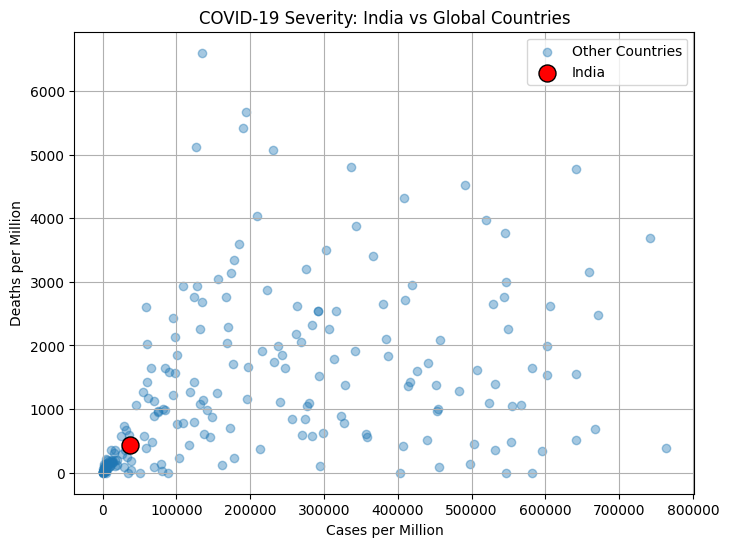
    

```python
plt.figure(figsize=(10,5))

sorted_comp = comparison_df.sort_values("total_deaths_per_million")

plt.bar(
    sorted_comp["location"],
    sorted_comp["total_deaths_per_million"]
)

plt.xticks(rotation=45, ha="right")
plt.ylabel("Deaths per Million")
plt.title("COVID-19 Deaths per Million: India vs Comparable Countries")
plt.show()

```

    
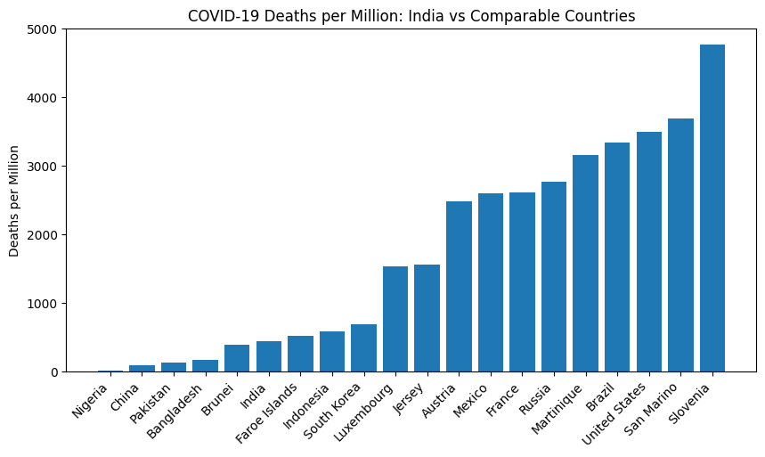
    
### Step 6: Statistical Framing

#### 6.1 Percentile Rank of India

```python
india_dpm = india_country_row["total_deaths_per_million"].values[0]

percentile = (
    global_df["total_deaths_per_million"] < india_dpm
).mean() * 100

print(f"India’s deaths per million is lower than {percentile:.2f}% of countries globally.")

```

    India’s deaths per million is lower than 39.65% of countries globally.
    

#### 6.2: Ranks in Number

#### 6.2.1: India’s rank by Deaths per Million (Mortality Rank)


```python
# Rank countries by deaths per million (higher = worse)
global_df["death_rank"] = global_df["total_deaths_per_million"].rank(
    ascending=False, method="min"
)

india_death_rank = global_df.loc[
    global_df["location"] == "India", "death_rank"
].values[0]

total_countries = len(global_df)

india_death_rank, total_countries
print(f"India ranks {int(india_death_rank)} out of {total_countries} countries in COVID-19 deaths per million, where a lower rank indicates lower mortality burden.")

```

    India ranks 137 out of 227 countries in COVID-19 deaths per million, where a lower rank indicates lower mortality burden.
    

#### 6.2.2: India’s rank by Cases per Million (Infection Exposure Rank)


```python
# Rank countries by cases per million (higher = worse)
global_df["case_rank"] = global_df["total_cases_per_million"].rank(
    ascending=False, method="min"
)

india_case_rank = global_df.loc[
    global_df["location"] == "India", "case_rank"
].values[0]

print(f"India ranks {int(india_case_rank)} out of {total_countries} countries in COVID-19 cases per million, indicating high exposure but not the highest globally.")
```

    India ranks 156 out of 227 countries in COVID-19 cases per million, indicating high exposure but not the highest globally.
    

### Step 7: Final Result Statement

Using global country-level data and India-focused checks, the analysis indicates that India's reported deaths per million are lower than many comparator countries, despite high case burden and weaker structural capacity indicators. Across scatter plots, peer-group bar comparisons, and percentile/rank summaries, India appears on the lower side of the global mortality-per-capita distribution.

This supports Hypothesis 1 under the scope of officially reported data. At the same time, cross-country differences in testing intensity, reporting practices, and attribution standards should be kept in mind when interpreting the result.

Note: This conclusion reflects reported data and does not rule out under-reporting.

### Data Sources and Acknowledgements
- Global COVID-19 data: Our World in Data (OWID)
- India state-level COVID-19 data: Government of India (MyGov / MoHFW)
- Population, GDP, and healthcare indicators: OWID and World Bank
- Analysis stack: Python (pandas, matplotlib, seaborn, scikit-learn), Jupyter Notebook


### Hypothesis 2: State-Level Comparison within India

Indian states with higher income, literacy, and healthcare capacity may show higher *reported* COVID-19 CFR because they tend to have stronger detection and reporting systems and, in several cases, higher exposure and older age structure. In contrast, some lower-capacity states may show lower reported CFR partly due to under-detection.

#### What this hypothesis tests
This hypothesis tests whether observed differences in state-level CFR are linked more to structural and reporting differences than to healthcare weakness alone.

#### Specifically, it examines whether states with:
- Higher income and literacy
- Better healthcare infrastructure

also tend to report higher CFR due to more complete case and death recording.

#### Datasets used
- india_covid_statewise.csv
- hospital_directory.csv
- HospitalsInIndia.csv
- Literacy_rate.csv

#### Quantification strategy
- Case Fatality Rate (CFR)
- Hospitals per 1,000 population
- Literacy rate
- Per-capita NSDP
- Cases per million (exposure control)

#### Planned analysis
##### 1. Compute state-level variables
- CFR
- Cases per million
- Hospitals per 1,000

##### 2. Visualizations
- Scatter: hospitals per 1,000 vs CFR
- Scatter/box comparisons: literacy and CFR
- Box plot: CFR in high-income vs low-income states

##### 3. Statistical checks
- Spearman/Pearson correlation
- Group-wise median comparisons

### Step 1: Load and clean state-level COVID data


```python
import pandas as pd

# Load COVID state-wise data
covid_states = pd.read_csv("india_covid_statewise.csv")

# Rename for consistency
covid_states = covid_states.rename(columns={
    "State/UTs": "State",
    "Total Cases": "Total_cases",
    "Deaths": "Deaths"
})

# Ensure numeric
covid_states["Total_cases"] = pd.to_numeric(covid_states["Total_cases"])
covid_states["Deaths"] = pd.to_numeric(covid_states["Deaths"])

# Add population from dictionary
covid_states["Population"] = covid_states["State"].map(india_population)

# Compute cases per million
covid_states["Cases_per_million"] = (
    covid_states["Total_cases"] / covid_states["Population"]
) * 1e6

# Compute CFR
covid_states["CFR"] = (
    covid_states["Deaths"] / covid_states["Total_cases"]
) * 100

covid_states.head()

```


<div>
<style scoped>
    .dataframe tbody tr th:only-of-type {
        vertical-align: middle;
    }

    .dataframe tbody tr th {
        vertical-align: top;
    }

    .dataframe thead th {
        text-align: right;
    }
</style>
<table border="1" class="dataframe">
  <thead>
    <tr style="text-align: right;">
      <th></th>
      <th>State</th>
      <th>Total_cases</th>
      <th>Active</th>
      <th>Discharged</th>
      <th>Deaths</th>
      <th>Active Ratio</th>
      <th>Discharge Ratio</th>
      <th>Death Ratio</th>
      <th>Population</th>
      <th>Cases_per_million</th>
      <th>CFR</th>
    </tr>
  </thead>
  <tbody>
    <tr>
      <th>0</th>
      <td>Maharashtra</td>
      <td>8176044</td>
      <td>213</td>
      <td>8027241</td>
      <td>148590</td>
      <td>0.00%</td>
      <td>98.18%</td>
      <td>1.82%</td>
      <td>112374333</td>
      <td>72757.219391</td>
      <td>1.817383</td>
    </tr>
    <tr>
      <th>1</th>
      <td>Kerala</td>
      <td>6917577</td>
      <td>13</td>
      <td>6845461</td>
      <td>72103</td>
      <td>0.00%</td>
      <td>98.96%</td>
      <td>1.04%</td>
      <td>33406061</td>
      <td>207075.506448</td>
      <td>1.042316</td>
    </tr>
    <tr>
      <th>2</th>
      <td>Karnataka</td>
      <td>4095971</td>
      <td>80</td>
      <td>4055493</td>
      <td>40398</td>
      <td>0.00%</td>
      <td>99.01%</td>
      <td>0.99%</td>
      <td>61095297</td>
      <td>67042.328970</td>
      <td>0.986286</td>
    </tr>
    <tr>
      <th>3</th>
      <td>Tamil Nadu</td>
      <td>3611584</td>
      <td>10</td>
      <td>3573488</td>
      <td>38086</td>
      <td>0.00%</td>
      <td>98.95%</td>
      <td>1.05%</td>
      <td>72147030</td>
      <td>50058.664924</td>
      <td>1.054551</td>
    </tr>
    <tr>
      <th>4</th>
      <td>Andhra Pradesh</td>
      <td>2341083</td>
      <td>5</td>
      <td>2326345</td>
      <td>14733</td>
      <td>0.00%</td>
      <td>99.37%</td>
      <td>0.63%</td>
      <td>49577103</td>
      <td>47221.052832</td>
      <td>0.629324</td>
    </tr>
  </tbody>
</table>
</div>


### Step 2: Add socioeconomic data (Literacy + Income)


```python
# Load literacy & income data
literacy = pd.read_csv("Literacy_rate.csv")

# Keep relevant columns
literacy = literacy[[
    "State_UT", "Literacy_rate", "NSDP_pc"
]].rename(columns={"State_UT": "State"})

# Merge with COVID data
state_df = covid_states.merge(literacy, on="State", how="left")

state_df.head()

```


<div>
<style scoped>
    .dataframe tbody tr th:only-of-type {
        vertical-align: middle;
    }

    .dataframe tbody tr th {
        vertical-align: top;
    }

    .dataframe thead th {
        text-align: right;
    }
</style>
<table border="1" class="dataframe">
  <thead>
    <tr style="text-align: right;">
      <th></th>
      <th>State</th>
      <th>Total_cases</th>
      <th>Active</th>
      <th>Discharged</th>
      <th>Deaths</th>
      <th>Active Ratio</th>
      <th>Discharge Ratio</th>
      <th>Death Ratio</th>
      <th>Population</th>
      <th>Cases_per_million</th>
      <th>CFR</th>
      <th>Literacy_rate</th>
      <th>NSDP_pc</th>
    </tr>
  </thead>
  <tbody>
    <tr>
      <th>0</th>
      <td>Maharashtra</td>
      <td>8176044</td>
      <td>213</td>
      <td>8027241</td>
      <td>148590</td>
      <td>0.00%</td>
      <td>98.18%</td>
      <td>1.82%</td>
      <td>112374333</td>
      <td>72757.219391</td>
      <td>1.817383</td>
      <td>84.8</td>
      <td>242247.0</td>
    </tr>
    <tr>
      <th>1</th>
      <td>Kerala</td>
      <td>6917577</td>
      <td>13</td>
      <td>6845461</td>
      <td>72103</td>
      <td>0.00%</td>
      <td>98.96%</td>
      <td>1.04%</td>
      <td>33406061</td>
      <td>207075.506448</td>
      <td>1.042316</td>
      <td>96.2</td>
      <td>228767.0</td>
    </tr>
    <tr>
      <th>2</th>
      <td>Karnataka</td>
      <td>4095971</td>
      <td>80</td>
      <td>4055493</td>
      <td>40398</td>
      <td>0.00%</td>
      <td>99.01%</td>
      <td>0.99%</td>
      <td>61095297</td>
      <td>67042.328970</td>
      <td>0.986286</td>
      <td>77.2</td>
      <td>301673.0</td>
    </tr>
    <tr>
      <th>3</th>
      <td>Tamil Nadu</td>
      <td>3611584</td>
      <td>10</td>
      <td>3573488</td>
      <td>38086</td>
      <td>0.00%</td>
      <td>98.95%</td>
      <td>1.05%</td>
      <td>72147030</td>
      <td>50058.664924</td>
      <td>1.054551</td>
      <td>82.9</td>
      <td>273288.0</td>
    </tr>
    <tr>
      <th>4</th>
      <td>Andhra Pradesh</td>
      <td>2341083</td>
      <td>5</td>
      <td>2326345</td>
      <td>14733</td>
      <td>0.00%</td>
      <td>99.37%</td>
      <td>0.63%</td>
      <td>49577103</td>
      <td>47221.052832</td>
      <td>0.629324</td>
      <td>66.4</td>
      <td>219518.0</td>
    </tr>
  </tbody>
</table>
</div>


### Step 3: Compute healthcare capacity (Hospitals per 1,000)


```python
# Load hospital directory
hospitals = pd.read_csv("hospital_directory.csv")

# Count hospitals per state
hospital_counts = (
    hospitals.groupby("State")
    .size()
    .reset_index(name="Total_hospitals")
)

# Merge with state_df
state_df = state_df.merge(hospital_counts, on="State", how="left")

# Compute hospitals per 1,000 population
state_df["Hospitals_per_1000"] = (
    state_df["Total_hospitals"] / state_df["Population"]
) * 1000

state_df.head()

```

    C:\Users\YASH GOYAL\AppData\Local\Temp\ipykernel_2412\3864808161.py:2: DtypeWarning: Columns (29,30,31,32,40) have mixed types. Specify dtype option on import or set low_memory=False.
      hospitals = pd.read_csv("hospital_directory.csv")
    


<div>
<style scoped>
    .dataframe tbody tr th:only-of-type {
        vertical-align: middle;
    }

    .dataframe tbody tr th {
        vertical-align: top;
    }

    .dataframe thead th {
        text-align: right;
    }
</style>
<table border="1" class="dataframe">
  <thead>
    <tr style="text-align: right;">
      <th></th>
      <th>State</th>
      <th>Total_cases</th>
      <th>Active</th>
      <th>Discharged</th>
      <th>Deaths</th>
      <th>Active Ratio</th>
      <th>Discharge Ratio</th>
      <th>Death Ratio</th>
      <th>Population</th>
      <th>Cases_per_million</th>
      <th>CFR</th>
      <th>Literacy_rate</th>
      <th>NSDP_pc</th>
      <th>Total_hospitals</th>
      <th>Hospitals_per_1000</th>
    </tr>
  </thead>
  <tbody>
    <tr>
      <th>0</th>
      <td>Maharashtra</td>
      <td>8176044</td>
      <td>213</td>
      <td>8027241</td>
      <td>148590</td>
      <td>0.00%</td>
      <td>98.18%</td>
      <td>1.82%</td>
      <td>112374333</td>
      <td>72757.219391</td>
      <td>1.817383</td>
      <td>84.8</td>
      <td>242247.0</td>
      <td>4807.0</td>
      <td>0.042777</td>
    </tr>
    <tr>
      <th>1</th>
      <td>Kerala</td>
      <td>6917577</td>
      <td>13</td>
      <td>6845461</td>
      <td>72103</td>
      <td>0.00%</td>
      <td>98.96%</td>
      <td>1.04%</td>
      <td>33406061</td>
      <td>207075.506448</td>
      <td>1.042316</td>
      <td>96.2</td>
      <td>228767.0</td>
      <td>890.0</td>
      <td>0.026642</td>
    </tr>
    <tr>
      <th>2</th>
      <td>Karnataka</td>
      <td>4095971</td>
      <td>80</td>
      <td>4055493</td>
      <td>40398</td>
      <td>0.00%</td>
      <td>99.01%</td>
      <td>0.99%</td>
      <td>61095297</td>
      <td>67042.328970</td>
      <td>0.986286</td>
      <td>77.2</td>
      <td>301673.0</td>
      <td>2226.0</td>
      <td>0.036435</td>
    </tr>
    <tr>
      <th>3</th>
      <td>Tamil Nadu</td>
      <td>3611584</td>
      <td>10</td>
      <td>3573488</td>
      <td>38086</td>
      <td>0.00%</td>
      <td>98.95%</td>
      <td>1.05%</td>
      <td>72147030</td>
      <td>50058.664924</td>
      <td>1.054551</td>
      <td>82.9</td>
      <td>273288.0</td>
      <td>2399.0</td>
      <td>0.033252</td>
    </tr>
    <tr>
      <th>4</th>
      <td>Andhra Pradesh</td>
      <td>2341083</td>
      <td>5</td>
      <td>2326345</td>
      <td>14733</td>
      <td>0.00%</td>
      <td>99.37%</td>
      <td>0.63%</td>
      <td>49577103</td>
      <td>47221.052832</td>
      <td>0.629324</td>
      <td>66.4</td>
      <td>219518.0</td>
      <td>1380.0</td>
      <td>0.027835</td>
    </tr>
  </tbody>
</table>
</div>


```python
state_df.to_csv("india_state_structural_covid.csv", index=False)

```

### Step 4: Key Variables and Formulas
The following formulas are defined explicitly and used throughout the analysis.

#### (a) Case Fatality Rate (CFR)

The Case Fatality Rate measures the proportion of confirmed cases that resulted in death.

$$
\text{CFR}_s = \frac{\text{Deaths}_s}{\text{Total Cases}_s} \times 100
$$

where \( s \) denotes a state.


#### (b) Cases per Million (Exposure Control)

Cases per million controls for population size and reflects how exposed a state was to infection.

$$
\text{Cases per Million}_s = \frac{\text{Total Cases}_s}{\text{Population}_s} \times 10^6
$$


#### (c) Hospitals per 1,000 Population (Healthcare Capacity)

This metric represents healthcare infrastructure availability in each state.

$$
\text{Hospitals per 1000}_s = \frac{\text{Total Hospitals}_s}{\text{Population}_s} \times 1000
$$


### Step 5: Visual Analysis


```python
import matplotlib.pyplot as plt

filtered = state_df.dropna(subset=["Hospitals_per_1000", "CFR", "State"]).copy()

plt.figure(figsize=(8, 6))
plt.scatter(
    filtered["Hospitals_per_1000"],
    filtered["CFR"],
    alpha=0.8
)

# Add state labels
for _, row in filtered.iterrows():
    plt.text(
        row["Hospitals_per_1000"],
        row["CFR"],
        row["State"],
        fontsize=8,
        alpha=0.8
    )

plt.xlabel("Hospitals per 1,000 Population")
plt.ylabel("Case Fatality Rate (%)")
plt.title("Healthcare Capacity vs CFR")
plt.grid(True)
plt.tight_layout()
plt.show()
```


    
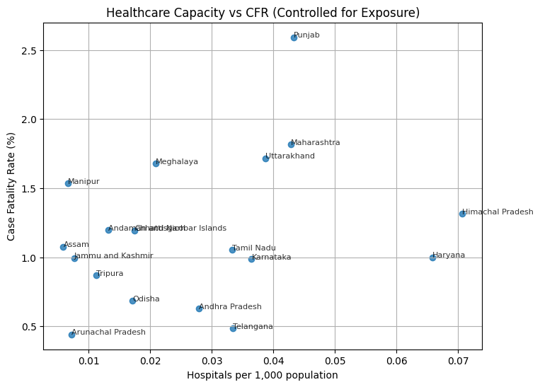
    


This plot suggests that raw CFR differences cannot be interpreted in isolation. Exposure intensity, reporting quality, and demographic composition are important confounders. Healthcare capacity still appears relevant, but the direction and strength of the relationship should be interpreted jointly with these structural factors.


```python
state_df["Literacy_group"] = pd.qcut(
    state_df["Literacy_rate"],
    q=3,
    labels=["Low literacy", "Medium literacy", "High literacy"]
)

plt.figure(figsize=(6,5))
state_df.boxplot(column="CFR", by="Literacy_group")
plt.title("CFR Distribution by Literacy Level")
plt.suptitle("")
plt.ylabel("Case Fatality Rate (%)")
plt.show()

```


    <Figure size 600x500 with 0 Axes>


    
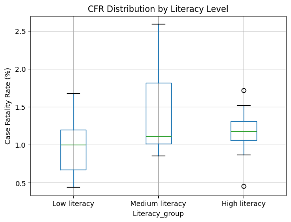
    


```python
# Median CFR by literacy group
literacy_cfr_stats = (
    state_df
    .groupby("Literacy_group")["CFR"]
    .agg(["count", "median", "mean"])
)

literacy_cfr_stats

```

    C:\Users\YASH GOYAL\AppData\Local\Temp\ipykernel_2412\4121133924.py:4: FutureWarning: The default of observed=False is deprecated and will be changed to True in a future version of pandas. Pass observed=False to retain current behavior or observed=True to adopt the future default and silence this warning.
      .groupby("Literacy_group")["CFR"]
    


<div>
<style scoped>
    .dataframe tbody tr th:only-of-type {
        vertical-align: middle;
    }

    .dataframe tbody tr th {
        vertical-align: top;
    }

    .dataframe thead th {
        text-align: right;
    }
</style>
<table border="1" class="dataframe">
  <thead>
    <tr style="text-align: right;">
      <th></th>
      <th>count</th>
      <th>median</th>
      <th>mean</th>
    </tr>
    <tr>
      <th>Literacy_group</th>
      <th></th>
      <th></th>
      <th></th>
    </tr>
  </thead>
  <tbody>
    <tr>
      <th>Low literacy</th>
      <td>12</td>
      <td>1.003515</td>
      <td>0.966881</td>
    </tr>
    <tr>
      <th>Medium literacy</th>
      <td>9</td>
      <td>1.114671</td>
      <td>1.461550</td>
    </tr>
    <tr>
      <th>High literacy</th>
      <td>11</td>
      <td>1.176541</td>
      <td>1.163051</td>
    </tr>
  </tbody>
</table>
</div>


The literacy-group comparison shows that medium- and high-literacy states often report higher CFR than low-literacy states. This does not automatically imply weaker healthcare outcomes in more literate states; it is also consistent with stronger case and death detection, better registration systems, and different demographic risk profiles.


```python
# Split states by median income
median_income = state_df["NSDP_pc"].median()

state_df["Income_group"] = state_df["NSDP_pc"].apply(
    lambda x: "High income" if x >= median_income else "Low income"
)

plt.figure(figsize=(6,5))
state_df.boxplot(
    column="CFR",
    by="Income_group"
)
plt.title("CFR Distribution by Income Group")
plt.suptitle("")
plt.ylabel("Case Fatality Rate (%)")
plt.show()

```


    <Figure size 600x500 with 0 Axes>


    
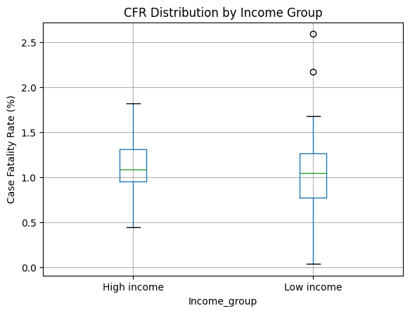
    


```python
# Summary statistics of CFR by income group
income_cfr_stats = (
    state_df
    .groupby("Income_group")["CFR"]
    .agg(["count", "median", "mean", "std"])
)

income_cfr_stats

```


<div>
<style scoped>
    .dataframe tbody tr th:only-of-type {
        vertical-align: middle;
    }

    .dataframe tbody tr th {
        vertical-align: top;
    }

    .dataframe thead th {
        text-align: right;
    }
</style>
<table border="1" class="dataframe">
  <thead>
    <tr style="text-align: right;">
      <th></th>
      <th>count</th>
      <th>median</th>
      <th>mean</th>
      <th>std</th>
    </tr>
    <tr>
      <th>Income_group</th>
      <th></th>
      <th></th>
      <th></th>
      <th></th>
    </tr>
  </thead>
  <tbody>
    <tr>
      <th>High income</th>
      <td>16</td>
      <td>1.084611</td>
      <td>1.098863</td>
      <td>0.390426</td>
    </tr>
    <tr>
      <th>Low income</th>
      <td>20</td>
      <td>1.048815</td>
      <td>1.104147</td>
      <td>0.594209</td>
    </tr>
  </tbody>
</table>
</div>


The income-group comparison indicates higher median and mean reported CFR in higher-income states. This pattern is plausibly linked to stronger reporting coverage and higher measured exposure, rather than a simple income-to-outcome deterioration story. Lower-income states may show artificially low observed CFR where detection and reporting are incomplete.

### Step 6: Statistical Checks

#### Step 6.1: Correlations


```python
corr_spearman = state_df[[
    "CFR",
    "Hospitals_per_1000",
    "Literacy_rate",
    "NSDP_pc",
    "Cases_per_million"
]].corr(method="spearman")

corr_spearman

```


<div>
<style scoped>
    .dataframe tbody tr th:only-of-type {
        vertical-align: middle;
    }

    .dataframe tbody tr th {
        vertical-align: top;
    }

    .dataframe thead th {
        text-align: right;
    }
</style>
<table border="1" class="dataframe">
  <thead>
    <tr style="text-align: right;">
      <th></th>
      <th>CFR</th>
      <th>Hospitals_per_1000</th>
      <th>Literacy_rate</th>
      <th>NSDP_pc</th>
      <th>Cases_per_million</th>
    </tr>
  </thead>
  <tbody>
    <tr>
      <th>CFR</th>
      <td>1.000000</td>
      <td>0.003676</td>
      <td>0.268170</td>
      <td>-0.166129</td>
      <td>-0.052252</td>
    </tr>
    <tr>
      <th>Hospitals_per_1000</th>
      <td>0.003676</td>
      <td>1.000000</td>
      <td>0.283698</td>
      <td>0.559956</td>
      <td>0.371992</td>
    </tr>
    <tr>
      <th>Literacy_rate</th>
      <td>0.268170</td>
      <td>0.283698</td>
      <td>1.000000</td>
      <td>0.375643</td>
      <td>0.559069</td>
    </tr>
    <tr>
      <th>NSDP_pc</th>
      <td>-0.166129</td>
      <td>0.559956</td>
      <td>0.375643</td>
      <td>1.000000</td>
      <td>0.664113</td>
    </tr>
    <tr>
      <th>Cases_per_million</th>
      <td>-0.052252</td>
      <td>0.371992</td>
      <td>0.559069</td>
      <td>0.664113</td>
      <td>1.000000</td>
    </tr>
  </tbody>
</table>
</div>


#### Step 6.2: Summary statistics table


```python
summary_stats = state_df[[
    "CFR",
    "Cases_per_million",
    "Hospitals_per_1000",
    "Literacy_rate",
    "NSDP_pc"
]].describe().T

summary_stats[["min", "50%", "max"]]

```


<div>
<style scoped>
    .dataframe tbody tr th:only-of-type {
        vertical-align: middle;
    }

    .dataframe tbody tr th {
        vertical-align: top;
    }

    .dataframe thead th {
        text-align: right;
    }
</style>
<table border="1" class="dataframe">
  <thead>
    <tr style="text-align: right;">
      <th></th>
      <th>min</th>
      <th>50%</th>
      <th>max</th>
    </tr>
  </thead>
  <tbody>
    <tr>
      <th>CFR</th>
      <td>0.034507</td>
      <td>1.065719</td>
      <td>2.591984</td>
    </tr>
    <tr>
      <th>Cases_per_million</th>
      <td>8217.334324</td>
      <td>43720.338410</td>
      <td>218342.772460</td>
    </tr>
    <tr>
      <th>Hospitals_per_1000</th>
      <td>0.003276</td>
      <td>0.017637</td>
      <td>0.078381</td>
    </tr>
    <tr>
      <th>Literacy_rate</th>
      <td>66.400000</td>
      <td>81.350000</td>
      <td>96.200000</td>
    </tr>
    <tr>
      <th>NSDP_pc</th>
      <td>49470.000000</td>
      <td>201854.000000</td>
      <td>472543.000000</td>
    </tr>
  </tbody>
</table>
</div>


### Step 7: Final Result Statement

The state-level analysis shows that variation in reported COVID-19 CFR across Indian states is systematic rather than random. Raw plots alone do not establish a simple monotonic relationship between CFR and infrastructure, but group comparisons and correlation checks indicate that exposure, reporting capacity, and structural conditions jointly shape observed outcomes.

States with higher income and literacy often report higher CFR, which is consistent with stronger detection/reporting and different demographic exposure profiles. Several lower-capacity states show lower observed CFR, which may partly reflect under-detection rather than better underlying outcomes.

Overall, the evidence supports Hypothesis 2: structural and socioeconomic differences materially influence how pandemic outcomes are observed and reported across states.

Note: This conclusion reflects reported data and does not rule out under-reporting.

## Data Sources and Acknowledgements
- Global COVID-19 data: Our World in Data (OWID), including country-level indicators on cases, deaths, testing, vaccination, population, GDP per capita, and healthcare capacity.
- India state-level COVID-19 data: Government of India (MyGov / Ministry of Health and Family Welfare).
- Population and socioeconomic indicators: Census of India, Reserve Bank of India (RBI), and NITI Aayog.
- Healthcare infrastructure data: public hospital directory datasets used for state-level capacity approximations.

```python

```
